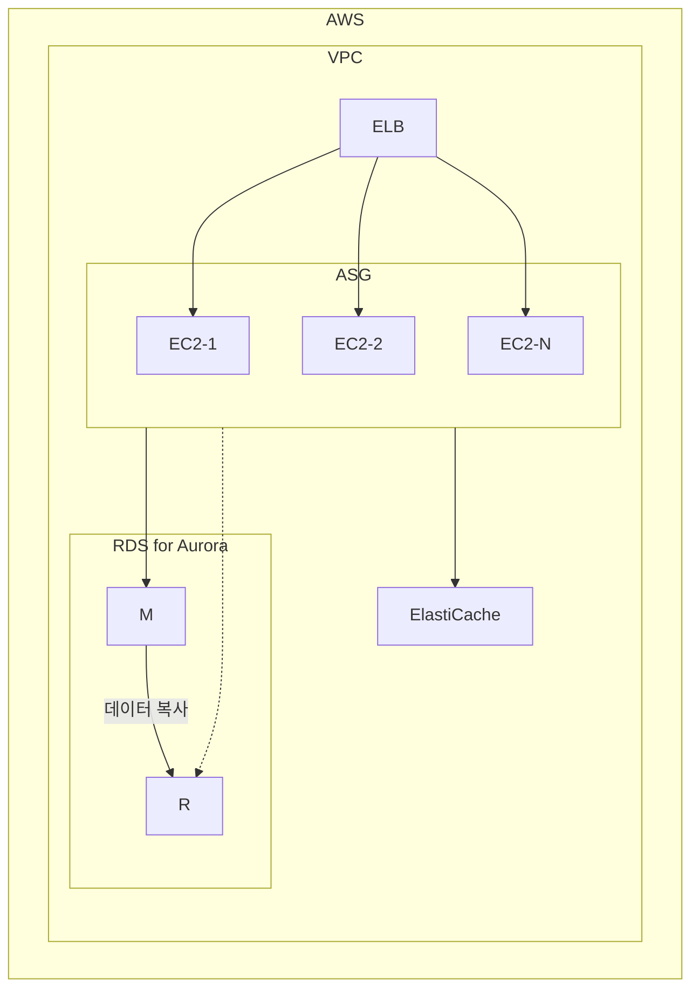

```mermaid
graph TD
	subgraph AWS
		subgraph VPC
			A[ELB] --> B;
			A --> C;
			A --> D;
			subgraph ASG
				B[EC2-1]
				C[EC2-2]
				D[EC2-N]
			end
			subgraph RDS for Aurora
				F[M] --데이터 복사--> G[R]
			end
			ASG --> E[ElastiCache]
			ASG --> F
			ASG -.-> G

			
		end
	end
```